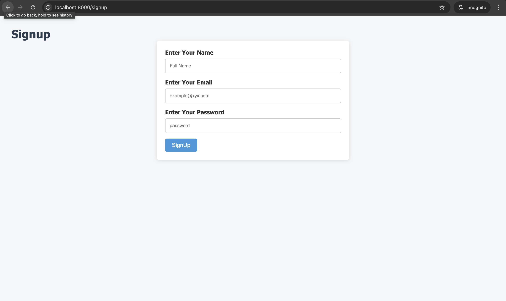
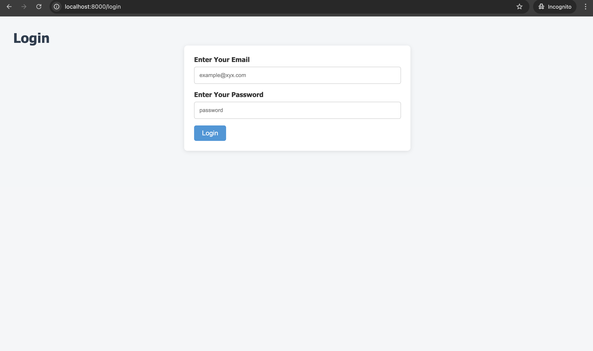
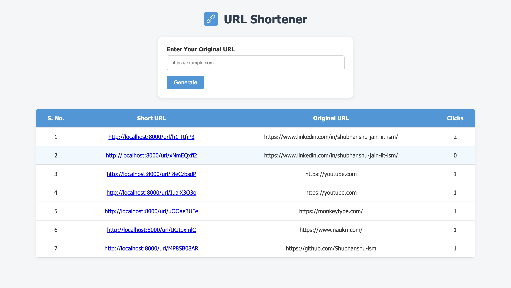
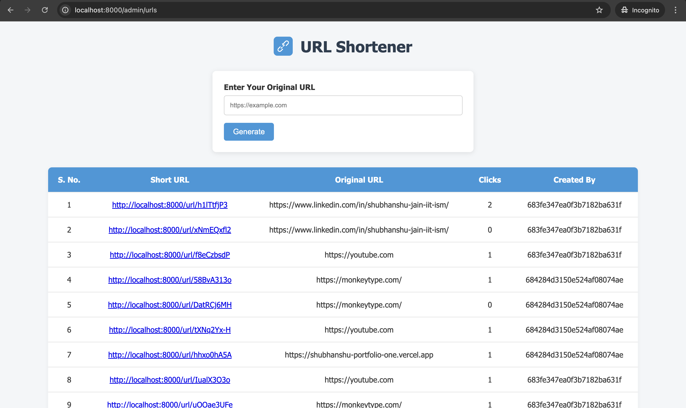

# 🔗 URL✂︎ Shortener

A full-stack URL shortener web application built with **Node.js**, **Express**, **MongoDB**, and **EJS**, featuring user authentication and an admin dashboard to monitor URLs and click statistics.

---

## ✨ Features

- 🔐 User Authentication (Signup & Login)
- 🧪 URL Shortening with Unique Links
- 📊 Click Tracking for Each Short URL
- 👨‍💼 Admin Dashboard with:
  - List of all shortened URLs
  - Click statistics
  - User who created each URL
- 📋 Clean and Responsive UI with HTML & CSS

---

## 📸 Screenshots


### 🔐 Signup Page


### 🔐 Login Page


### 🏠 Home (User Dashboard)


### 👨‍💼 Admin Dashboard


---

## 🏗️ Tech Stack

- **Frontend**: HTML, CSS, EJS Templates
- **Backend**: Node.js, Express.js
- **Database**: MongoDB with Mongoose
- **Authentication**: Cookie-based authentication
- **Unique ID Generation**: `shortid`

---

## 🚀 Getting Started

### 1. Clone the Repository

```bash
git clone https://github.com/your-username/url-shortener.git
cd url-shortener
````

### 2. Install Dependencies

```bash
npm install
```

### 3. Configure Environment Variables

Create a `.env` file in the root directory and add:

```env
PORT=8000
MONGO_URL=mongodb://127.0.0.1:27017/urlShortener
```

### 4. Start the Development Server

```bash
npm start
```

Navigate to: [http://localhost:8000](http://localhost:8000)

---

## 📁 Folder Structure

```
├── models/              # Mongoose schemas for URL and User
├── routes/              # Express routes (auth, url, admin)
├── views/               # EJS templates (login, signup, home, admin)
├── public/              # Static assets (CSS, images)
├── middlewares/         # Custom middlewares (auth handling)
├── app.js               # Main server file
├── .env                 # Environment config
└── README.md
```

---

## ✅ Functionalities

| Feature           | Status |
| ----------------- | ------ |
| User Signup/Login | ✅      |
| URL Shortening    | ✅      |
| Click Tracking    | ✅      |
| Admin Panel       | ✅      |
| Cookie-based Auth | ✅      |

---

## 🛡️ Security

* **Note**: Passwords are currently stored in **plain text**. It is recommended to hash them using a library like `bcrypt.js` in production.
* Authentication tokens are stored in cookies
* Routes are protected with custom middleware (`restrictToLoggedinUserOnly`)

---

## 🙌 Author

**Shubhanshu Jain** 
📧 [shubhanshujain2233@gmail.com](mailto:shubhanshujain2233@gmail.com)
🔗 [LinkedIn](https://www.linkedin.com/in/shubhanshu-jain-iit-ism/)
💻 [Portfolio](https://shubhanshu-portfolio-one.vercel.app)

---

## 📜 License

This project is licensed under the MIT License.

